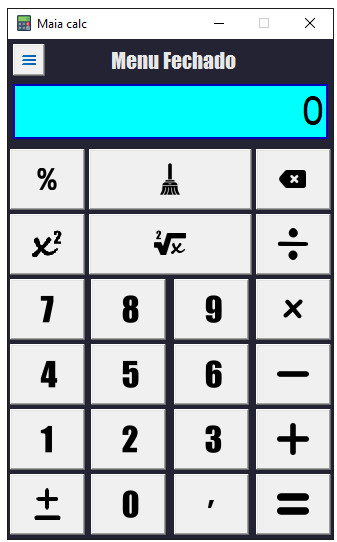

# Maia Calc Version 0.1
# Calculadora feita com Python 3.11.2 com módulo tkinter. 
  

  

 

### Calculadora leve e com operações matemáticas simples. O resto deixo com você, faça do seu próprio jeito.

 

  
## Imagem da calculadora Maia Calc Versão 0.1

 

